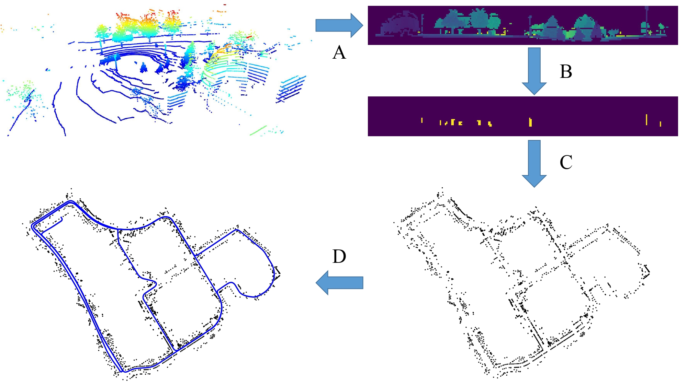

# Online Range Image-based Pole Extractor for Long-term LiDAR Localization in Urban Environments

This repo contains the code for our ECMR2021 paper: Online Range Image-based Pole Extractor for Long-term LiDAR Localization in Urban Environments.

Developed by [Hao Dong](https://sites.google.com/view/dong-hao/) and [Xieyuanli Chen](https://www.ipb.uni-bonn.de/people/xieyuanli-chen/). The code is based on Alexander's [polex](https://github.com/acschaefer/polex).




Overview of our approach. A. we project the LiDAR point cloud into a range image and B. extract poles in the image. C. based on the extracted poles, we then build a global pole map of the environment. D. we finally propose a pole-based observation model for MCL to localize the robot in the map.


## Publication
If you use our implementation in your academic work, please cite the corresponding [paper](https://www.ipb.uni-bonn.de/wp-content/papercite-data/pdf/dong2021ecmr.pdf):
    
	@InProceedings{dong2021ecmr,
        author = {H. Dong and X. Chen and C. Stachniss},
        title = {{Online Range Image-based Pole Extractor for Long-term LiDAR Localization in Urban Environments}},
        booktitle = {Proceedings of the European Conference on Mobile Robots (ECMR)},
        year = {2021}
    }

## Dependencies

The code was tested with Ubuntu **20.04** with its standard python version **3.8**.

- Python dependencies

  ```bash
  pip install numpy matplotlib open3d-python progressbar2 pyquaternion transforms3d scipy scikit-image networkx numba arrow pykitti
  ```


## How to use

#### NCLT Dataset
Download the [dataset](http://robots.engin.umich.edu/nclt/) and extract the data in the `/nclt/data` folder following the recommended [data structure](nclt/README.md), and then run:
  ```bash
  python src/ncltpoles.py
  ```

#### KITTI Dataset
Download the KITTI raw data `2011_09_26_drive_0009` by navigating to the `/kitti/raw_data` folder and run:
  ```bash
  ./kitti_downloader.sh
  ```
then run:
  ```bash
  python src/kittipoles.py
  ```

#### MulRan Dataset
Download the `KAIST 01` and `KAIST 02` [dataset](https://sites.google.com/view/mulran-pr/download) and extract the data in the `/mulran/data` folder following the recommended [data structure](mulran/README.md), and then run:
  ```bash
  python src/mulranpoles.py
  ```

## Pole Dataset
The pole datasets are stored in the `/data/pole-dataset/KITTI` and `/data/pole-dataset/NCLT` folders. The data are stored in `.npz` format with the shape `N*2`. Each row represents the `x` and `y` position of one pole. You can evaluate the pole extraction with the groud-truth pole map by running:
  ```bash
  python src/test_match.py
  ```

## License

Copyright 2021, Hao Dong, Xieyuanli Chen, Cyrill Stachniss, Photogrammetry and Robotics Lab, University of Bonn.

This project is free software made available under the MIT License. For details see the LICENSE file.


